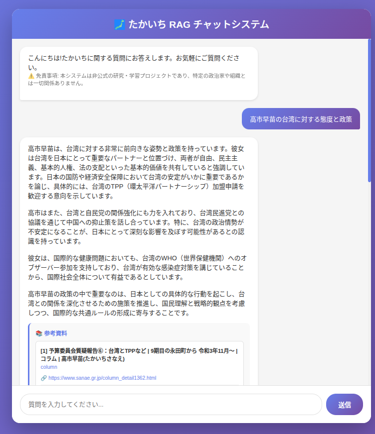

# 一次情報で政治を知る：日本語RAGシステムで高市早苗新総裁の公式サイトを分析

> 🔗 **デモ**: https://takaichi.kizuna.ai/
> 📦 **GitHub**: https://github.com/jiangzhuo/TakaichiRAG

## はじめに：なぜこのプロジェクトを作ったのか

政治家に関する情報をインターネットで調べると、さまざまな解釈や意見が混在していて、**客観的な一次情報にたどり着くのが意外と難しい**ことに気づきました。特に、2025年10月4日に自民党総裁に選出された高市早苗氏のように、日本の未来を担う政治家について、本人の言葉や公式見解を直接知りたいと思っても、情報が断片化していて全体像を掴みにくいのです。

**きっかけ**：総裁選挙の期間中、SNSやニュースサイトで流れる情報と公式見解の間にギャップを感じたことでした。「本人の言葉を直接AIに学習させたら、より客観的な情報提供ができるのでは？」という素朴な疑問から、このプロジェクトが始まりました。

さらに、[公式サイト（sanae.gr.jp）](https://www.sanae.gr.jp/)を見ると、**膨大な量の一次情報**があることに気づきました：
- 📝 **コラム**: 1,038記事
- 🎤 **記者会見**: 707記事
- 🏆 **実績**: 7記事
- 📜 **基本理念**: 1記事
- 🎯 **政治姿勢**: 1記事

**合計1,754記事**もの情報を、人間が全て読んで理解するのは現実的ではありません。だからこそ、RAGシステムで効率的に検索・質問できる仕組みが必要だと考えました。

そこで、**高市早苗新総裁の[公式ウェブサイト（sanae.gr.jp）](https://www.sanae.gr.jp/)から直接情報を収集し、RAG（Retrieval-Augmented Generation）システムで質問応答できる**実験的なプロジェクトを作りました。



## RAGとRAGLite：シンプルで強力な質問応答システム

### RAG (Retrieval-Augmented Generation) とは

RAGは、大規模言語モデル（LLM）に**外部の知識ベースを検索して参照させながら回答を生成**させる技術です。これにより：

- ✅ **最新情報**に基づいた回答が可能
- ✅ **ハルシネーション（幻覚）** を大幅に削減
- ✅ **出典を明示**できるため信頼性が高い

### なぜRAGLiteを選んだのか

今回は [RAGLite](https://github.com/superlinear-ai/raglite) というフレームワークを採用しました。選定理由：

- 🚀 **軽量でシンプル**：複雑な設定不要で素早く実装できる
- 📦 **DuckDB統合**：ローカルで完結する高速データベース
- 🔧 **柔軟性**：Embedding、Rerankerを自由に選択可能
- 🎌 **多言語対応**：日本語でも高い精度

## 技術選定のポイント

### DuckDBの選択理由：RAGに最適なデータベース

データベースには**DuckDB**を採用しました：

```python
DEFAULT_RAG_CONFIG = RAGLiteConfig(
    db_url="duckdb:///raglite.db",  # ローカルファイルベース
    llm="gpt-4o-mini",
    embedder="text-embedding-3-large",
    reranker=Reranker("ms-marco-MultiBERT-L-12", model_type="flashrank")
)
```

#### なぜDuckDBがRAGに適しているのか

従来、RAGシステムを構築する際は以下のような複雑な構成が必要でした：
- **PostgreSQL + pgvector**: ベクトル検索用
- **Elasticsearch**: 全文検索用
- **Redis/Memcached**: キャッシング用

しかし、**DuckDBは1つで完結**します。その理由は：

**1. FTS（Full-Text Search）のネイティブサポート**

DuckDBは高速な全文検索機能を内蔵しています：

```sql
-- DuckDBでの全文検索例
CREATE INDEX fts_idx ON documents USING FTS(content);
SELECT * FROM documents WHERE content MATCH '高市早苗 AND 経済政策';
```

キーワードベースの検索とベクトル検索を**ハイブリッド**で使えるため、より精度の高い検索が可能です。

**2. VSS（Vector Similarity Search）の高速化**

DuckDBはベクトルの類似度検索も高速に実行できます：

```sql
-- ベクトル検索例（RAGLiteが内部的に実行）
SELECT document_id, content,
       array_cosine_similarity(embedding, $query_vector) AS similarity
FROM document_chunks
ORDER BY similarity DESC
LIMIT 5;
```

RAGLiteはDuckDBの機能を活用して：
- 📊 **Embedding vectors**をカラムに保存
- 🔍 **コサイン類似度**で高速に関連文書を検索
- 🎯 FTSとVSSの**ハイブリッド検索**で精度向上

**3. その他の利点**

- 📁 **セットアップ不要**：単一ファイル（raglite.db）で動作
- ⚡ **高速**：カラムナストレージで分析クエリに最適化
- 💾 **軽量**：サーバー不要、数MB〜数GBのデータに最適
- 🔧 **SQLアナリティクス**：集計やフィルタリングが柔軟

PostgreSQL + pgvectorやElasticsearchと比べて、**個人プロジェクトやプロトタイプには圧倒的に導入が楽**で、かつ本番環境でも十分な性能を発揮します。

RAGLiteがDuckDBをデフォルトで採用しているのも、この**FTS + VSSのハイブリッド検索能力**が理由です。

### 日本語RAGでの考慮点

日本語でRAGを構築する際、**EmbeddingとRerankerの選択**が重要です：

#### Embedding: `text-embedding-3-large`

OpenAIの最新Embeddingモデルで、**日本語の意味理解が強化**されています。

```python
embedder="text-embedding-3-large"
```

- 🎯 文脈を考慮した高精度な類似度検索
- 🌏 多言語に対応しつつ日本語の性能が高い

#### Reranker: `ms-marco-MultiBERT-L-12` (FlashRank)

検索結果を**再ランキング**して最も関連性の高い文書を上位に持ってくる役割：

```python
from rerankers import Reranker

reranker=Reranker("ms-marco-MultiBERT-L-12", model_type="flashrank", verbose=0)
```

**選定理由**：
- 🌐 **100+言語対応**：日本語を含む多言語で高精度
- ⚡ **FlashRankによる高速化**：推論が軽量で実用的
- 📊 **MultiBERTベース**：多言語BERTの強力な言語理解力

日本語RAGでは、Embeddingだけでなく**Rerankerの選択も精度に大きく影響**します。特に政治的な文脈や専門用語が多い文書では、再ランキングにより関連性の高い情報を正確に取り出せます。

## Webクローラー実装：丁寧なスクレイピング

公式サイトから情報を収集するクローラーは、`requests` + `BeautifulSoup4` で実装しました：

```python
from bs4 import BeautifulSoup
import requests
from requests.adapters import HTTPAdapter
from requests.packages.urllib3.util.retry import Retry

class WebCrawler:
    def _create_session(self):
        session = requests.Session()

        # リトライロジック実装
        retry_strategy = Retry(
            total=3,
            backoff_factor=1,
            status_forcelist=[429, 500, 502, 503, 504]
        )

        session.mount("http://", HTTPAdapter(max_retries=retry_strategy))
        return session
```

### Polite Scrapingの実践

サーバーに負荷をかけないよう、以下の配慮をしています：

- ⏱️ **リクエスト間隔**：1秒のdelay設定
- 🔄 **リトライロジック**：エラー時は指数バックオフ
- 📋 **重複回避**：訪問済みURL管理で無駄なリクエストを削減

```python
SCRAPER_CONFIG = {
    "delay_between_requests": 1.0,  # サーバーに優しく
    "timeout": 30,
}
```

### カテゴリ別データ収集

[公式サイト（sanae.gr.jp）](https://www.sanae.gr.jp/)の構造に合わせて5つのカテゴリを収集：

- 📜 **基本理念** (idea.html)
- 🎯 **政治姿勢** (posture.html)
- 🏆 **実績** (results.html)
- 🎤 **記者会見** (kaiken.html)
- ✍️ **コラム** (column.html)

特に記者会見とコラムは**2階層構造**（リストページ → 詳細ページ）になっており、再帰的にクローリングしています。

## 使い方とデモ

### CLIでの質問応答

```bash
# データ収集からインデックス作成、対話モードまで一括実行
python main.py --all

# 対話モード
python main.py --chat
```

### Web UIでの利用

FastAPIベースのWebインターフェースも用意しました：

```bash
python main.py --web
```

ブラウザで `http://localhost:8000` にアクセスすると、モダンなUIで質問できます。

## 成果と学び

このプロジェクトを通じて：

- ✅ **一次情報の重要性**を再認識
- ✅ 日本語RAGの**Embedding/Reranker選定**のノウハウを獲得
- ✅ **DuckDBの手軽さ**を実感
- ✅ **RAGLiteのシンプルさ**が個人プロジェクトに最適

特に、公式ウェブサイトの情報を構造化してRAGで検索できるようにすることで、**断片化された情報を一元的に質問できる**価値を実感しました。

## おわりに

政治家の情報に限らず、**信頼できる一次情報源から知識ベースを構築し、AIで検索・質問応答**できる仕組みは、様々な分野で応用可能です。

このプロジェクトはあくまで**実験的・教育目的**ですが、RAGの実装例として、また日本語での技術選定の参考として役立てば幸いです。

### リンク

- 🔗 **デモサイト**: https://takaichi.kizuna.ai/
- 📦 **GitHub**: https://github.com/jiangzhuo/TakaichiRAG
- 📚 **RAGLite**: https://github.com/superlinear-ai/raglite
- 🦆 **DuckDB**: https://duckdb.org/

---

**免責事項**：本システムは教育・研究目的で作成されています。AI生成コンテンツは誤りを含む可能性があるため、重要な情報は必ず公式サイトで確認してください。
